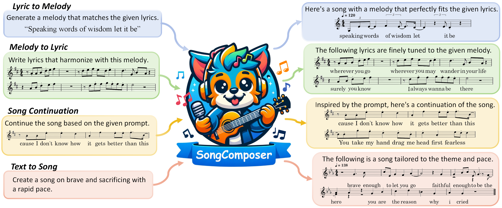

<a href="https://mark12ding.github.io/">Shuangrui Ding*1</a>,  
<a href="https://scholar.google.com/citations?user=iELd-Q0AAAAJ">Zihan Liu*2,3</a>,  
<a href="https://lightdxy.github.io/">Xiaoyi Dong3</a>,  
<a href="https://panzhang0212.github.io/">Pan Zhang3</a>,  
<a href="https://shvdiwnkozbw.github.io/">Rui Qian1</a>,  
<a href="https://scholar.google.com/citations?user=fnfHBoAAAAAJ">Junhao Huang3</a>,  
<a href="https://conghui.github.io/">Conghui He3</a>,  
<a href="http://dahua.site/">Dahua Lin3</a>,  
<a href="https://myownskyw7.github.io/">Jiaqi Wang&dagger;3</a> 

1The Chinese University of Hong Kong, 2Beihang University, 3Shanghai AI Laboratory

 *  Equal Contribution. &dagger;Corresponding authors. 

<a href="https://arxiv.org/abs/2402.17645">arXiv</a> | 
<a href="https://github.com/pjlab-songcomposer/songcomposer">code</a>

                   

# Abstract
A song typically comprises the vocal track and the music track. 
Creating lyrics and melodies for the vocal track in a symbolic format, known as song composition, plays a significant role in the song generation.
This delicate and complex task demands expert musical knowledge of melody, an advanced understanding of lyrics, and precise alignment between them. Despite achievements in sub-tasks such as lyric generation, lyric-to-melody, and melody-to-lyric, etc, a unified model for song composition has not yet been achieved. 
In this work, we introduce SongComposer, **a pioneering step towards a unified song composition model that can readily create symbolic lyrics and melodies following instructions**. SongComposer is a music-specialized large language model (LLM) that, for the first time, integrates the capability of simultaneously composing lyrics and melodies into LLMs. To achieve this goal, three non-trivial efforts are introduced.
**1) Sheet music understanding**, we designed a flexible tuple format to load lyric and note attributes, fostering word-level alignment between lyrics and melodies, and enabling SongComposer to generate lyrics with accompanying well-aligned melodies. 
**2) Song note tokenizing**, the vocabulary of the tokenizer is extended for song notes, and we find a proper scalar-manner initialization of new tokens based on musical prior is essential for the model to understand musical rhythm.
**3) Structural music generation**, we propose a multi-stage pipeline for progressively capturing the musical structure. Initially, we extract and feed motif-level melody patterns to SongComposer to build its basic generation capabilities. Later, we insert special tokens into the whole-song data to denote phrase-level structure, promoting logical repetition and smooth coherence.
Extensive experiments demonstrate that SongComposer outperforms advanced LLMs, including GPT-4, in tasks such as lyric-to-melody generation, melody-to-lyric generation, song continuation, and text-to-song creation.

# Generated Samples
The following showcases audio samples generated by our SongComposer in the text-to-song task, covering both English and Chinese. Here, we utilize [ACE Studio](https://acestudio.ai/) to synthesize singing voice and incorporate multi-track accompaniments with the help of [NetEase Tianyin](https://tianyin.music.163.com/).

# English Demo
## Example 1
   **Given Text Prompt :** Write an English song about the fleeting nature of time and the nostalgia for past joys.

   **Vocal :** <audio controls=""><source src="resources/showcase/EN_song_0.wav" type="audio/wav"></audio>

   **Vocal + Accompaniment :** <audio controls="" ><source src="resources/showcase/EN_song_0_acc.mp3" type="audio/wav"></audio>

   **Lyrics :** 
    
    <verse>
    i can't believe how time has slipped right through my fingers 
    it's like a thief in the night it comes when you're not looking 
    and the days just fly by when you're not keeping time 
    and the reasons that we came were lost along the way 
    now i'm staring out of the window at the rushing crowd hall 
    trying to catch a glimpse of myself or was it all a dream 

    <chorus>
    i remember that summer ran away
    the sun blew our minds we thought we'd be forever 
    and i know that time has no power over us if we 
    believe it we can make our own kind of heaven
    we can go back go back together 
    we can go back go back together  
    go back together 

    <verse>
    i can't believe how time has slipped right through my fingers
    it's like a thief in the night it comes when you're not looking 
    and the days just fly by when you're not keeping time
    and the reasons that we came were lost along the way 
    now i'm staring  out of the window at the rushing crowd  
    trying to catch a glimpse of  myself or was it all a dream 

    <chorus>
    and i remember that summer ran away
    the sun blew our minds we thought we'd be forever 
    and i know that time has no power over us if we 
    believe it we can make our own kind of heaven
    we can go back go back together go back together go back together
    we can go back together go back together 

## Example 2
   **Given Text Prompt :** Write an energetic English song about a powerful movement that shakes the world and inspires everyone to join in.

   **Vocal :** <audio controls="" ><source src="resources/showcase/EN_song_2.wav" type="audio/wav"></audio>

   **Vocal + Accompaniment :** <audio controls="" ><source src="resources/showcase/EN_song_2_acc.wav" type="audio/wav"></audio>

   **Lyrics :** 
    
    <verse>
    we came in like a northern storm blew y'all doors off 
    hung the world upside down 
    and now y'all better know the drill 
    if you're not with us then you must be against us 
    we won't stop until 
    we're worldwide until everybody singing this our theme our theme song 
    we gotta keep the fire burning even though 
    it's harder to keep the flame alive inside 

    <chorus>
    when you're calling my name out 
    when you're calling my name out 
    when you're calling my name out 
    when you're calling my name out 
    we came in like a northern storm blew y'all doors off 
    hung the world upside down 
    hung the world upside down 

## Example 3
   **Given Text Prompt :** Write an English song about suffering in an intimate relationship.

   **Vocal :** <audio controls="" ><source src="resources/showcase/EN_song_1.wav" type="audio/wav"></audio>
   
   **Vocal + Accompaniment :** <audio controls="" ><source src="resources/showcase/EN_song_1_acc.wav" type="audio/wav"></audio>
   
   **Lyrics :** 
    
    <verse>
    you got me all stressed out my boy 
    get up in my grill and i'm burn in when i tell you how i feel you 
    tell me to chill you never
    take it from me 
    but i'm gonna be me no matter what you say 

    <chorus>
    I know I always push your buttons,buttons, yes it's true
    But I'm gonna find a way to express my love for you
    I'll do things my way, my way, with affection in my heart
    I won't change for you 
    Even if you don't love me 

# Chinese Demo
## Example 1
   **Given Text Prompt :** Compose a Chinese song about two people sharing their dreams and sorrows, and finding strength in their companionship.

   **Vocal :** <audio controls="" ><source src="resources/showcase/ZH_song_3.wav" type="audio/wav"></audio>
   
   **Vocal + Accompaniment :** <audio controls="" ><source src="resources/showcase/ZH_song_3_acc.wav" type="audio/wav"></audio>
   
   **Lyrics :** 

    <verse>
    你 说 你 的 天 空 很 大 
    大 得 可 以 盛 下 你 所 有 梦 想 
    我 说 我 的 天 空 很 小 
    小 得 只 想 装 下  
    我 爱 的 姑 娘 
    你 说 你 的 忧 伤 
    想 要 找 个 人 来 分 摊 一 下 
    我 说 我 的 忧 伤
    一 个 人 也 撑 得 起
    一 个 人 收 场 

    <chorus>
    这 样 吧 
    你 的 梦 我 帮 你 撑 起 一 半 
    那 我 的 梦 你 帮 我 装 进 背 包 
    你 的 笑 帮 助 我 驱 散 阴 霾 
    那 你 的 泪 我 帮 你 慢 慢 擦 干
    你 的 梦 我 帮 你 撑 起 一 半 
    我 的 梦 你 帮 我 装 进 背 包 
    你 的 笑 帮 助 我 驱 散 阴 霾 
    你 的 泪 我 帮 你 慢 慢 擦 干 
    你 的 笑 帮 助 我 驱 散 阴 霾 
    你 的 泪 我 帮 你 慢 慢 擦 干

**English Translation of Lyrics :** 

    <verse>
    You said your sky is big
    Big enough to hold all your dreams
    I said my sky is small
    Small, only wanting to hold
    The girl I love
    You said your sorrows
    Want to find someone to share
    I said my sorrows
    I can bear it alone
    Alone to the end

    <chorus>
    Okay then
    I'll help you hold half of your dreams
    Then you help pack my dreams in the backpack
    Your smile helps me dispel the gloom
    And your tears I'll gently wipe dry
    Your dreams I'll help you hold half
    Then you help pack my dreams in the backpack
    Your smile helps me dispel the gloom
    Your tears I'll help you wipe dry
    Your smile helps me dispel the gloom
    Your tears I'll help you wipe dry

## Example 2
   **Given Text Prompt :** Compose a Chinese song about love.
   
   **Vocal :** <audio controls="" ><source src="resources/showcase/ZH_song_2.wav" type="audio/wav"></audio>
   
   **Vocal + Accompaniment :** <audio controls="" ><source src="resources/showcase/ZH_song_2_acc.mp3" type="audio/wav"></audio>
   
   **Lyrics :** 

    <verse>
    如 果 你 看 不 到 月 亮 
    我 的 手 腕 是 船 舵 
    如 果 你 听 不 见 我 的 歌 唱 
    那 颗 星 星 不 会 跑 到 山 后 
    如 果 你 哭 得 太 累 的 时 候 
    你 就 靠 着 我 的 肩 头 睡 吧 
    如 果 你 感 到 孤 独 的 夜 晚 
    就 把 我 的 心 留 给 你 一 半 

    <chorus>
    我 们 相 爱 在 这 个 冬 天
    就 是 冻 掉 十 指 头 也 不 肯 分 开
    我 们 爱 在 这 个 寒 冬 
    十 指 紧 相 合 
    我 们 的 温 度 正 在 升 高 
    看 不 到 云 上 的 月 亮 
    我 的 手 腕 就 是 你 的 船 舵 
    听 不 见 我 的 歌 唱 
    歌 唱 那 颗 星 不 会 跑 到 山 后 
    哭 得 太 累 的 时 候 你 就 靠 着 我 的 肩 头 
    感 到 孤 独 的 夜 晚 就 把 我 的 心 留 给 你 一 半 
    给 你 一 半

**English Translation of Lyrics:** 

    <verse>
    If you can't see the moon
    My wrist is the rudder
    If you can't hear my singing
    That star won't run behind the mountain
    If you cry too tired
    Just lean on my shoulder and sleep
    If you feel lonely at night
    Leave half of my heart for you

    <chorus>
    We fell in love in this cold winter
    Even frozen ten fingers won't separate
    We fell in love in this cold winter
    Ten fingers tightly hold
    Our temperature is rising
    Can't see the moon above the clouds
    My wrist is your rudder
    Can't hear my singing
    Singing that star won't run behind the mountain
    Too tired to cry, you just
    Lean on my shoulder
    Feeling lonely at night, just leave half of my heart for you
    Give you half

## Example 3
   **Given Text Prompt :** Write a Chinese song to express the missing feelings.
   
   **Vocal :** <audio controls="" ><source src="resources/showcase/ZH_song_1.wav" type="audio/wav"></audio>
   
   **Vocal + Accompaniment :** <audio controls="" ><source src="resources/showcase/ZH_song_1_acc.mp3" type="audio/wav"></audio>
   
   **Lyrics :** 

    <verse>
    当 你 的 眼 神 淹 没 有 焦 点 
    当 你 的 双 手 放 不 在 身 边
    请 把 我 的 名 字 写 在 床 尾 端 
    请 把 我 的 灵 魂 带 在 你 身  

    <chorus>
    关 于 你 的 消 息 请 让 我 知 情 
    如 果 我 还 有 遗 憾 留 在 这 
    没 有 绝 望 的 明 天 没 有 实 现 
    没 有 勇 气 去 面 对 已 经 改 变 
    当 我 的 视 线 看 不 见 光 亮 点 
    请 把 我 的 名 字 写 在 床 尾 
    请 把 我 的 灵 魂 带 在 你 身 边 
    关 于 你 的 消 息 请 让 我 知 情 
    如 果 我 还 有 遗 憾 留 在 这 
    没 有 绝 望 的 明 天 没 有 实 现 
    没 有 勇 气 去 面 对 已 经 改 变

**English Translation of Lyrics:** 

    <verse>
    When your gaze is drowned in aimlessness
    When your hands cannot rest by your side
    Please write my name at the foot of the bed
    Please carry my soul with you

    <chorus>
    Let me know about your news
    If I still have regrets left here
    No desperate tomorrow, no realization
    no courage to face what has already changed
    When my sight cannot see the light
    Please write my name at the foot of the bed
    Please carry my soul with you   
    let me know about your news
    If I still have regrets left here
    No desperate tomorrow, no realization
    No courage to face what has already changed
 

